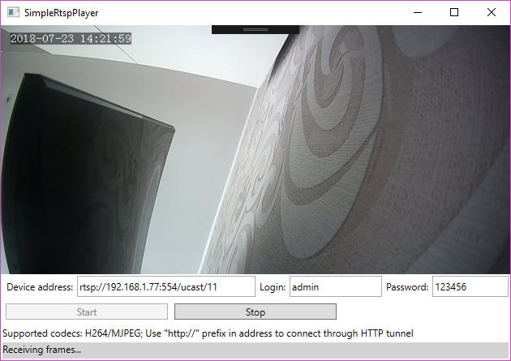

# Simple RTSP Player

## Features
- WPF (MVVM pattern)
- Frame decoding through FFmpeg library
- Supported scaling modes: auto, stretch, respect aspect ratio
- Supported scaling modes: nearest, bilinear, bicubic (default)
- Low GC pressure

# 